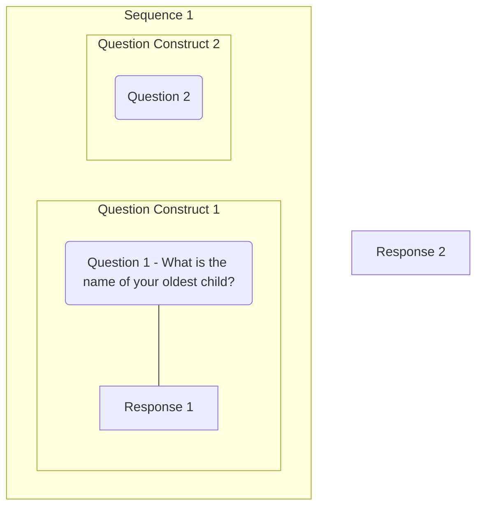

# Parameters

## Parameter flow

!!! question "Updating this documentation"

    Instead of reproducing the original WT graph, we should probably document what is done at Insee (see second paragraph).

The parameter flow principle especially in the case of filtering, conditional text (question, instruction or categories), derived variables or computation items is described in annex to the DDI 3.2 specification. It is recommended to track the parameter value at each step of the DDI questionnaire flow. An illustration provided by Wendy Thomas is given below.

The path followed by the parameter values is as follows: QI1 -> RD -> QC1 -> SEQ -> QC2 → QI2, if the assumption is made that the QuestionConstruct and the IfThenElse are nested in a mutual Sequence (otherwise an extra element layer should be added: <r:binding> and <r:Outparameter>/<r:Inparameter>).
Insee has adopted a simplified version of it which links directly the parameters from the response domains to the question objects that take these parameters as inputs, e.g: QI1 -> RD1 -> QI2.
